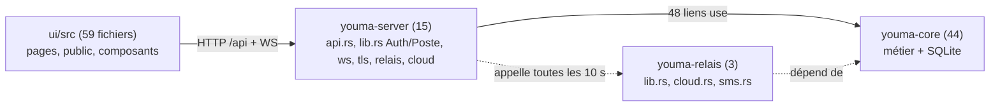

# Architecture — Youma (carte au commit e5d816b, 3 octobre 2026)

Logiciel de restaurant **local-first** pour le Mali. Un **poste central** (PC caisse Windows) détient la seule base
SQLite et sert l'interface web aux téléphones du Wi-Fi ; un **relais Internet facultatif** sert les pages publiques
(menu en ligne, suivi, livreur, propriétaire) et le cloud. Référence : `docs/CAHIER_DES_CHARGES.md`, `CLAUDE.md`.

## Stack

| Couche | Techno | Où |
| --- | --- | --- |
| Métier | Rust, rusqlite, migrations `PRAGMA user_version` 0001→0011 | `crates/youma-core` (≈ 12 000 l.) |
| Poste central | axum, WebSocket, TLS local, impression ESC/POS | `crates/youma-server` (164 routes dans `api.rs`) |
| Relais Internet | axum + SQLite propre, SMS Orange, cloud multi-restaurants | `crates/youma-relais` |
| Licences | Ed25519 hors ligne (outil fournisseur) | `crates/youma-licence` |
| Interface | React 19 + TS, Vite 8, React Router 7, lucide, Poppins embarquée | `ui/src` |
| Bureau | Coquille Tauri autour du serveur | `apps/desktop` (hors workspace) |

## Découpage (communautés de la carte)

Fiches par module : `modules/socle.md`, `ventes.md`, `caisse-clients.md`, `stock-achats.md`, `personnel-paie.md`,
`canaux-distance.md`, `rapports.md`, `serveur.md`, `relais.md`, `interface.md`. Règles métier : `DOMAINE.md`.
Étude mobile (documents du 30/09) confrontée au code : `ETUDE-MOBILE.md`.

## Points d'entrée

- `crates/youma-server/src/main.rs` → `lib.rs::demarrer` (HTTP 7878, HTTPS 7879, `--reseau`, `--demo`).
- `crates/youma-relais/src/main.rs` → `lib.rs::demarrer` ; `youma-licence/src/main.rs`.
- `ui/src/main.tsx` → `App.tsx` (routes, appairage, pages publiques sans connexion).
- `apps/desktop/src-tauri/src/main.rs` (construit `youma_server::Config` : tout nouveau champ de `Config` s'y ajoute).

## Flux d'une écriture

Interface `useApp().agir(…)` → `api.ts::appel` (`fetch('/api…')`, `Authorization: Bearer`, `X-Appareil`,
`X-Autorisation-Pin`) → `api.rs` macro `ecrire!` → extracteur `Auth` (`lib.rs:145`) → `Db::executer(acteur, |op| …)`
(`db.rs:205` : transaction, `op.exiger(perm)`, `op.audit`, `op.outbox`, `op.evenement`) → WebSocket diffuse
l'événement (identifiant seul) → les écrans rechargent la ressource.

## Fichiers les plus sollicités (lancer `impact` avant d'y toucher)

`youma-server/src/api.rs` (importe 43 modules), `youma-core/src/db.rs` (importé par 31), `erreur.rs` (34),
`caisse.rs` (21), `ui/src/api.ts` (37), `types.ts` (35), `format.ts` (34), `contexte.tsx` (32), `composants/Base.tsx` (32).

## Tests

`cargo test --workspace` (core : `tests/regles.rs`, `scenarios.rs`, `canaux.rs`, `fidelite.rs`…, serveur
`tests/api.rs`, relais `tests/relais.rs`), `cd ui && npm test` (Vitest), Playwright `ui/e2e/` contre
`target/debug/youma-server --demo` port 7979, en série. CI : `.github/workflows/ci.yml`.

## Outillage de la carte

`python3 <skill>/scripts/carte.py . --sortie AI_CONTEXT --md` (régénère `carte.json`, `ALERTES.md`,
`architecture.mmd`, non versionnés) ; `requete`, `impact`, `expliquer`, `verifier`, `session`, `reprendre`.
